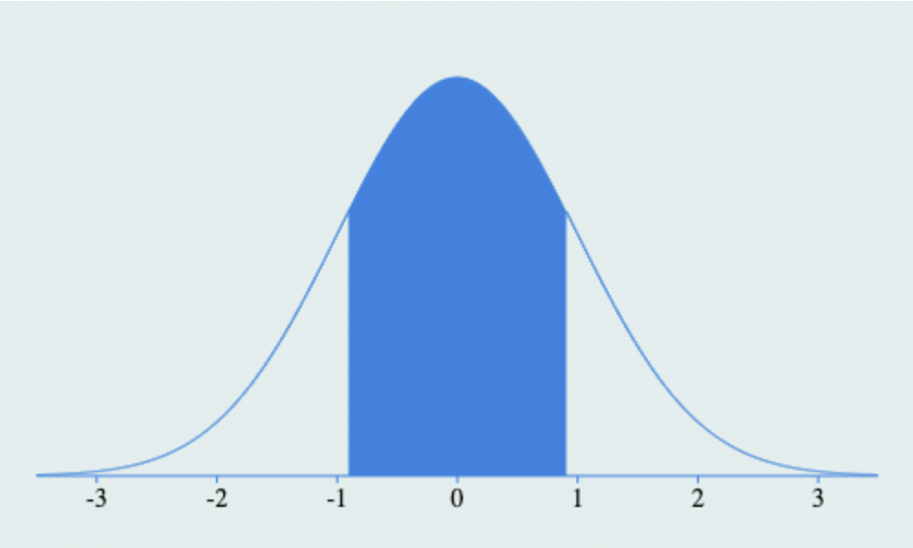
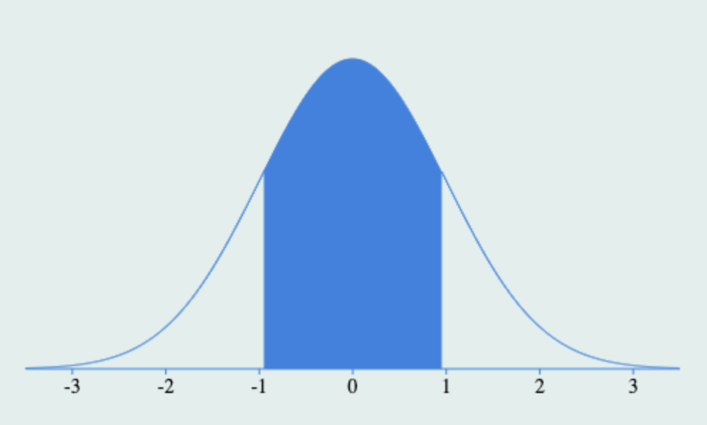
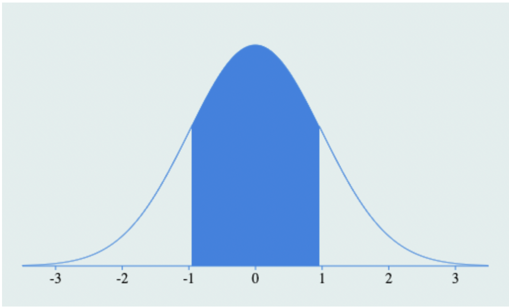
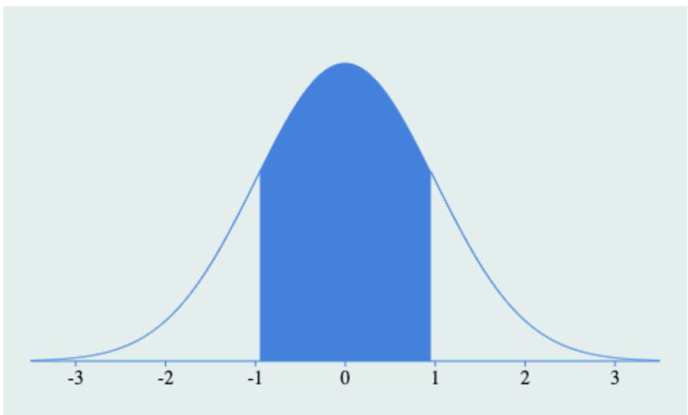
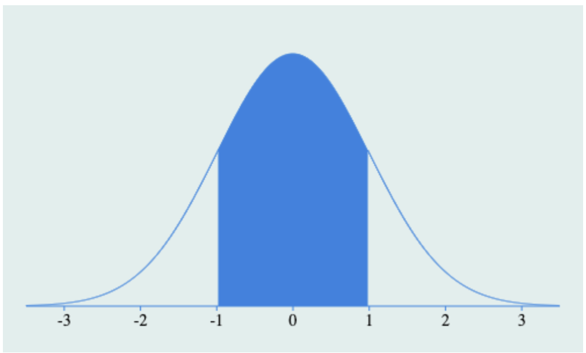
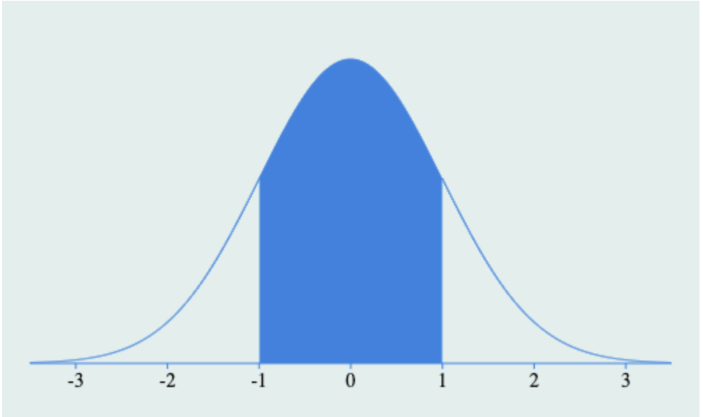

```{r, include=FALSE}
library(Rlab)
```

### Questão 1
_Se a variável Z tem distribuição normal padrão, isto é, Z ∼ N(0_ 1), obtenha:_


_a) P(Z < 1,64)_

**Resposta:** 0.9495

_b) P(Z = 1,64)_

**Resposta:** 0

_c) P(Z $\leq$ 1,64)_

**Resposta:** 0.9495

_d) P(Z < −1,64)_

**Resposta:** 0.0505

_e) P(−1,64 < Z < 1,64)_

**Resposta:** 0.899

_f) P(Z > 1,64)_

**Resposta:** 0.0505

_g) o valor do quantil z, da tabela (de preferência da acumulada) da normal padrão, tal que, P(Z < z) = 0, 05 (5%)_

**Resposta:**  -1.644854

_h) o valor do quantil z, da tabela da normal padrão, tal que, P(Z $\geq$ z) = 0, 05._

**Resposta:** 2.64

_i) Apresente os inputs e ouputs usando a linguagem R de todos os cálculos dos itens anteriores._

**Resposta:**

_a) input pnorm(1.64,mean=0,sd=1) output: [1] 0.9494974_

_b) input  output:_

_c) input pnorm(1.64,mean=0,sd=1) output: [1] 0.9494974_

_d) input pnorm(-1.64,mean=0,sd=1) output: [1] 0.05050258_

_e) input pnorm(1.64,mean=0,sd=1)-pnorm(-1.64,mean=0,sd=1) output:[1] 0.8989948_

_f) input 1-pnorm(1.64,mean=0,sd=1) output: [1] 0.05050258_

_g) input qnorm(0.05,mean=0,sd=1) output: [1] -1.644854_

_h) input 1-qnorm(0.05,mean=0,sd=1) output: [1] 2.644854_

### Questão 2
_Seja X uma v.a, tal que, X ∼ N(100, 25), determinar:_

_a) P(X $\geq$ 108)_

**Resposta:** 0.0548

_b) P(X = 100)_

**Resposta:** 0.5

_c) P(89 $\leq$ X $\leq$ 107)_

**Resposta:** 0.90534

_d) P(12 < X − µ < 16)_

**Resposta:** 0.0075

_e) P(112 < X < 116)_

**Resposta:** 0.00751

_f) P(X < 100 ou X > 106)_

**Resposta:**  0.61507

_g) o valor do quantil x, tal que P(X < x) = 0, 05_

**Resposta:** 91.7757

_h) o valor do quantil x, tal que P(X > x) = 0, 05_

**Resposta:** 108.2243

_i) o valor do quantil x, tal que P(X > x) = 0, 975_

**Resposta:** 90.2

_j) Apresente os inputs e ouputs usando a linguagem R de todos os cálculos dos itensanteriores sem usar a distribuição da variável padronizada $Z =\frac{X−\mu}{σ}$._

_a) input 1 - pnorm(108,mean=100,sd=5) output: [1] 0.05479929_

_b) input pnorm(100,mean=100,sd=5) output: [1] 0.5_

_c) input pnorm(107, mean = 100, sd = 5) - pnorm(89, mean = 100, sd = 5) output: [1] 0.9053399_

_d) input pnorm(3.2,mean=0,sd=1)-pnorm(2.4,mean=0,sd=1) output: [1] 0.0075_

_e) input pnorm(116, mean = 100, sd = 5) - pnorm(112, mean = 100, sd = 5) output:[1] 0.007510398_

_f) input 1-pnorm(106, mean = 100, sd = 5, lower.tail = TRUE) + pnorm(100, mean = 100, sd = 5, lower.tail = FALSE) output: [1] 0.6150697_

_g) input qnorm(0.05, mean = 100, sd = 5) output:[1] 91.77573_

_h) input qnorm(0.05, mean = 100, sd = 5 lower.tail=FALSE) output: [1] 108.2243_

_i) input qnorm(0.975, mean = 100, sd = 5, lower.tail=FALSE) output: [1] 90.20018_


### Questão 3
_A vida útil (em anos) de um computador pessoal tem distribuição aproximadamente normal com média de 2,9 anos e variância de 1,96 anos_

_a)  Que proporção dos computadores falhará no primeiro ano?_

**Resposta:** $0,4131$ aproximadamente $41,31$%

_b) Que proporção dos computadores durará quatro anos ou mais?_

**Resposta** A proporção é de $78,52$%.

_c)  Que proporção dos computadores durará no mínimo dois anos?_

**Resposta** A proporção é de $73,89$%

_d) Que proporção dos computadores durará mais de 2,5 anos, porém menos de quatro anos?_ 

**Resposta** A proporção é de $39,93$%.

_e)  Se o fabricante adota uma política de garantia segundo a qual no máximo 0,5% dos computadores devem de ser substituídos, qual é o período dessa garantia?_

**Resposta** O período é $6,498$ anos.

_f) Se 10.000 computadores são vendidos, quantos esperasse serem devolvidos à fábrica segundo a política de garantia adotada acima?_

**Resposta** Espera-se a devolução de $50$ computadores.

_g) Qual é o valor da vida útil em que o mesmo é superado em 5%?_

**Resposta** O valor da vida útil é $5,196$ anos.

\newpage

### Questão 4
_Mostre que, em qualquer distribuição normal, à área sob a curva (probabilidade), determinada por cada um dos intervalos abaixo, é sempre a mesma e independente dos parâmetros da distribuição_

a) (µ − 1,64${σ}$; µ + 1,64${σ}$);

**Resposta**

para simplificar  atribuimos $x = µ − 1,64{σ}$ e $y = µ + 1,64{σ}$

_portanto :_

$Zy = 1,64$ e $Zx = -1,64$

resolvendo $P(Zx < Z < Zy)$

$$P(Zx < Z < Zy) = P(-1,64 < Z < 1,64)$$

$$=  P(Z < 1,64) - P(Z < - 1,64)$$
$$  = 0.9495 - 0.0505 = 0.8990$$

{width=300 height=150px}

b) (µ − 1,96${σ}$; µ + 1,96${σ}$);

**Resposta**

para simplificar  atribuimos $x = µ − 1,96{σ}$ e $y = µ + 1,96{σ}$

_portanto :_

$Zy = 1,96$ e $Zx = -1,96$

resolvendo $P(Zx < Z < Zy)$

$$P(Zx < Z < Zy) = P(-1, 96 < Z < 1, 96)$$

$$              =  P(Z < 1, 96) - P(Z < - 1, 96)$$

$$              = 0.9750 - 0.0250 = 0.9500$$

{width=300 height=150px}


c) (µ − 2,57${σ}$; µ + 2,57${σ}$);

**Resposta**

para simplificar  atribuimos $x = µ − 2,57{σ}$ e $y = µ + 2,57{σ}$

_portanto :_

$Zy = 2,57$ e $Zx = -2,57$

resolvendo $P(Zx < Z < Zy)$

$$P(Zx < Z < Zy) = P( 2,57  < Z < 2,57)$$

$$              =  P(Z < 2,57) - P(Z < - 2,57 )$$

$$              = 0.9772 - 0.0227 = 0.9545$$

{width=300 height=150px}


\newpage

### Questão 5
_Se a variável aleatória Z segue o comportamento de uma distribuição normal padrão, diga quais devem ser o valor do quantil z tal que:_

_a) P(−z < Z < z) = 0,90 (90,0%)_

**Resposta:** $P (−0.95 ≤ 𝑋 ≤ 0.95) = 0.9$

{width=300 height=150px}

_b) P(−z < Z < z) = 0,95 (95,0%)_

**Resposta:** $P (−0.975 ≤ 𝑋 ≤ 0.975) = 0.95$

{width=300 height=150px}

_c) P(−z < Z < z) = 0,99 (99,0%)_

**Resposta:** $P (−0.995 ≤ 𝑋 ≤ 0.995) = 0.99$

{width=300 height=150px}

_d) Esboce um gráfico para cada uma dessas situações e elabore uma tabela dos resultados obtidos para você memorizar._

**Resposta:** Os gráficos foram inseridos logo acima.

_e) Existe alguma relaçãao dos resultados desta questão com a anterior (a Questão 4)? Se sim, qual(ais)?_

**Resposta:**

